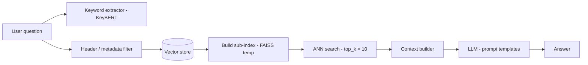

# BÁO CÁO KẾT QUẢ TUẦN 3

**Tên đề tài:** Xây dựng hệ thống hỏi đáp tự động ứng dụng kỹ thuật LLM Ops và RAG  
**Giảng viên hướng dẫn:** ThS. Nguyễn Văn Chiến  
**Sinh viên thực hiện:**

- Nguyễn Ngọc Tâm - 2151040051
- Phạm Hoài Kiệt - 2251150058

**Thời gian thực hiện:** 28/10/2025 - 03/11/2025

---

## 1. Mục tiêu

Báo cáo tóm tắt kết quả tuần 3 đạt được, các điểm cải tiến so với tuần 2, hạn chế còn tồn tại và kế hoạch tuần 4.

---

## 2. Kết quả đạt được

- Chuẩn hóa prompting bằng template: Bổ sung config/prompt_templates.py và render_prompt(...); LLM giờ nhận prompt_template rõ ràng (planning/qa/acting/observing), thuận tiện A/B và tái sử dụng.
- Tăng độ chính xác truy hồi bằng pre-filter: Thêm bước lọc metadata trước khi search (header_path_filter, match linh hoạt: list→membership, str→substring, kiểu khác→exact), sau đó build FAISS tạm thời trên tập con ➜ giảm nhiễu và tập trung vào tài liệu phù hợp.Bổ sung chức năng trích xuất từ khóa trong câu hỏi, sử dụng KeyBERT kết hợp Jaccard similarity để lọc các vector ít liên quan trong top_k. Việc truy xuất tài liệu tập trung vào các chunk liên quan đến nội dung câu hỏi.
- Giảm độ trễ ở bước tổng hợp ngữ cảnh: Điều chỉnh top_k mặc định từ 100 → 10 trong answer generation, cắt chi phí hợp nhất ngữ cảnh khi tập sau lọc đã đủ hẹp.
- Quan sát/giám sát retrieval tốt hơn: Bổ sung logger chi tiết (số lượng vector sau lọc, đường đi dữ liệu, bước build index…), giúp debug sai lệch tìm kiếm nhanh hơn.
- Refactor luồng gọi LLM: GeminiGenerator.generate_answer(...) nhận template, thống nhất cách dựng prompt và tham số, giảm ràng buộc cứng trong mã.
### Sơ đồ xử lý: pre-filter ➜ sub-index ➜ top_k

- Thu hẹp không gian tìm kiếm trước bằng metadata filter.
- Sau đó lập chỉ mục con và query top_k trên tập nhỏ ⇒ precision tăng & latency giảm.
- Prompt templates + logging giúp ổn định đầu ra và dễ debug.
---

## 3. Điểm cải tiến so với tuần 2

- Từ QA interface gọn hơn → “prompting có cấu trúc”: Tuần 2 dừng ở refactor interface; tuần 3 thêm bước chuẩn hóa template để kiểm soát hành vi mô hình theo từng pha.
- Từ “keyword extraction” → “pre-filter + sub-index”: Tuần 2 dùng KeyBERT + Jaccard để lọc top_k; tuần 3 đưa lọc lên trước khi search và lập chỉ mục con
  ➜ bớt nhiễu, tăng precision khi kho dữ liệu lớn.
- Logging rộng: Tuần 2 chuẩn hóa logging toàn pipeline; tuần 3 đặt log sâu ở retrieval (lọc/index/search) giúp rà lỗi thực chiến nhanh hơn.
- Tối ưu hiệu năng hướng mục tiêu: Giảm top_k mặc định giúp rút ngắn thời gian trả lời mà vẫn giữ liên quan.

---

## 4. Hạn chế

- Chưa tích hợp conversation memory, chưa có cơ chế lưu lịch sử hội thoại. Model trả lời dựa trên câu hỏi hiện tại, chưa kết hợp ngữ cảnh các câu hỏi trước.
- Retrieval hiện tại chỉ thực hiện một lượt truy vấn, chưa hỗ trợ multi-hop reasoning hoặc tổng hợp thông tin từ nhiều nguồn.
- Giảm top_k có rủi ro giảm recall: Với domain rộng/đề bài dài, top_k=10 đôi khi chưa đủ; cần cơ chế tự điều chỉnh theo truy vấn.

---

## 5. Hướng nghiên cứu và kế hoạch cho tuần 4

- Nghiên cứu về Agentic RAG để xây dựng pipeline có khả năng tự tổng hợp thông tin từ nhiều nguồn, giúp mô hình suy luận tốt hơn.
- Nghiên cứu tích hợp ngữ cảnh hội thoại (conversation memory) để mô hình trả lời thông minh hơn, có khả năng xử lý các đoạn chat dài và đa lượt.
- Tối ưu adaptive retrieval & caching (điều chỉnh top_k, cache sub-index) để giảm độ trễ mà vẫn giữ độ chính xác.

---

## 6. Tóm tắt tuần 3 (28/10/2025 - 03/11/2025)

- Precision tăng, Latency giảm nhờ pre-filter metadata → sub-index FAISS → ANN (adaptive top_k).
- ĐChuẩn hóa prompting với template (planning/qa/observing/acting); refactor luồng gọi LLM.
- Logging retrieval chi tiết (lọc/index/search) → dễ debug và giám sát.
- Còn 3 điểm cần khắc phục: tích hợp conversation memory (multi-turn), xây pipeline multi-step retrieval/Agentic RAG, top_k=10 có rủi ro giảm recall ở domain rộng.
- Kế hoạch tuần này tập trung vào: tiêp tục triển khai kế hoạch lưu lịch sử chat vào model, thu thập tài liệu LLMOps/Agentic RAG và triển khai Agentic/Multi-hop RAG và tối ưu adaptive retrieval & caching (auto-tune top_k, cache sub-index).

