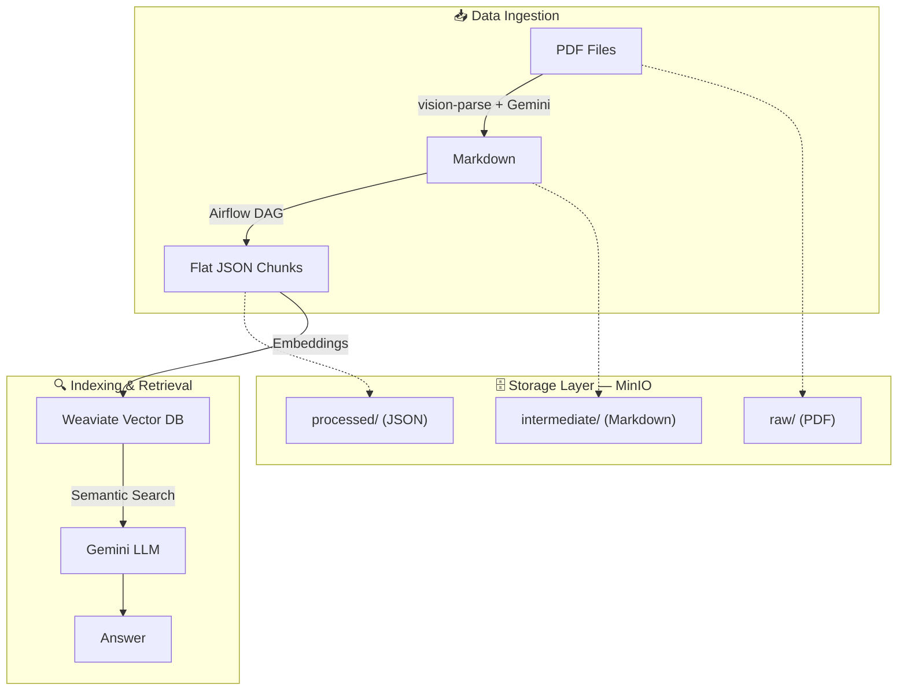

# RAG System for Vietnamese Educational Documents

A **Retrieval Augmented Generation (RAG)** system designed to answer questions about Vietnamese university curricula. The pipeline processes PDF documents through extraction, chunking, indexing, and retrieval stages — fully orchestrated with Apache Airflow and containerized with Docker.

## 📐 System Architecture



### Technology Stack

| Layer | Technology |
| :--- | :--- |
| **PDF Extraction** | `vision-parse` + Gemini API |
| **Chunking** | Custom Markdown hierarchy parser (`ProcessorTasks`) |
| **Object Storage** | MinIO (S3-compatible) |
| **Path Management** | `MinIOPathManager` |
| **Vector Database** | Weaviate |
| **Orchestration** | Apache Airflow 3 (CeleryExecutor) |
| **Embedding** | `weaviate-client` + Sentence Transformers |
| **Packaging** | Docker Compose (modular `include` pattern) |

---

## 🗂 Project Structure

See [PROJECT_STRUCTURE.md](./PROJECT_STRUCTURE.md) for the full directory tree and module details.

---

## 📚 Documentation

| Document | Description |
| :--- | :--- |
| [PROJECT_STRUCTURE.md](./PROJECT_STRUCTURE.md) | Full directory tree & module descriptions |
| [docs/chunking_pipeline.md](./docs/chunking_pipeline.md) | Detailed pipeline flow diagrams (PDF → MD → JSON → Vector) |
| [docs/architecture/class_diagram.md](./docs/architecture/class_diagram.md) | Class hierarchy & component relationships |
| [specs/data_pipeline_spec.md](./specs/data_pipeline_spec.md) | Functional specification for the data pipeline |
| [airflow/README.md](./airflow/README.md) | Airflow setup, DAG guide & Dockerfile pre-build steps |

---

## 🚀 Deployment Guide

The system runs on Docker Compose. All services (Airflow, MinIO, Weaviate) share a single `rag_network`.

### Prerequisites
- Docker & Docker Compose installed.
- Internet connection for the first build (to pre-download Python packages — see [airflow/README.md](./airflow/README.md)).

### 1. Configure Environment
```bash
cp .env.example .env
# Then edit .env to fill in your GEMINI_API_KEY_1, MinIO credentials, etc.
```

### 2. Pre-build Airflow Image (Offline Mode)
The Airflow image installs Python packages from a local folder to avoid re-downloading on every build. Follow the steps in [airflow/README.md](./airflow/README.md) before the first build.

### 3. Start All Services
```bash
docker compose up -d --build
```

### 4. Access Dashboards

| Service | URL | Default Credentials |
| :--- | :--- | :--- |
| **Airflow UI** | [http://localhost:8081](http://localhost:8081) | `airflow` / `airflow` |
| **MinIO Console** | [http://localhost:9001](http://localhost:9001) | `admin` / `admin123` |
| **Weaviate** | [http://localhost:8080](http://localhost:8080) | — |

---

## 👤 Author

- Developed by Nguyen Ngoc Tam.
- Contact: [nguyenngoctam0332003@gmail.com](mailto:nguyenngoctam0332003@gmail.com)