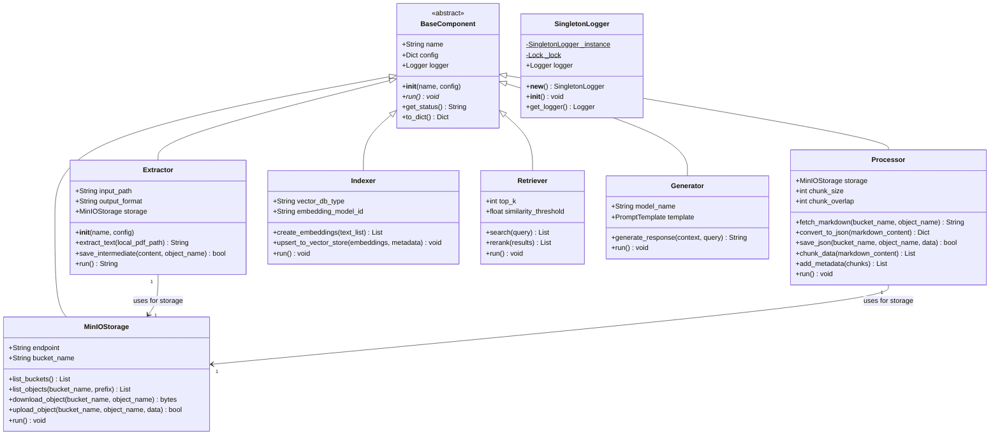
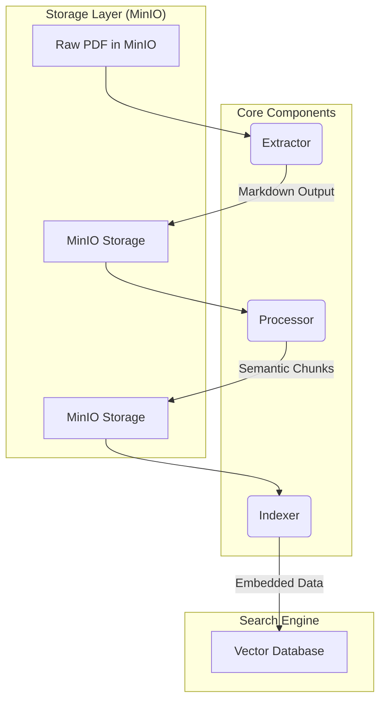

# Project Class Hierarchy

This document describes the architectural structure of the Agentic RAG system using a class diagram. To maintain consistency and modularity, all system components inherit from a common base class.

## Class Diagram

## Component Details

### 1. BaseComponent (Abstract)
The root class for all functional modules in the pipeline. It ensures that every component has a consistent way of being initialized, executed, and providing status updates.

- **`name`**: Unique identifier for the component instance.
- **`config`**: Dictionary containing component-specific settings (e.g., paths, hyperparameters).
- **`run()`**: The main execution entry point for the component.

### 2. Extractor
Handles the conversion of raw documents (PDFs) into an intermediate format (Markdown).
- **Inherits from**: `BaseComponent`

### 3. Processor
Responsible for semantic chunking of the intermediate Markdown content and enriching chunks with relevant metadata.
- **Inherits from**: `BaseComponent`

### 4. Indexer
Manages the embedding process and interaction with the Vector Database (e.g., Qdrant or Chroma).
- **Inherits from**: `BaseComponent`

### 5. Retriever
Executes the search logic to find the most relevant chunks based on a user query.
- **Inherits from**: `BaseComponent`

### 6. Generator
Interfaces with the LLM to generate the final educational responses based on retrieved context.
- **Inherits from**: `BaseComponent`

### 7. MinIOStorage
Handles interactions with MinIO for storing raw, intermediate, and processed files.
- **Inherits from**: `BaseComponent`

### 8. SingletonLogger
A thread-safe singleton utility providing a unified logging interface for the entire system.
- **Note**: This is a standalone utility, not inheriting from `BaseComponent`.

## Pipeline Flow

The following diagram illustrates how the components interact to create an automated ETL/Indexing pipeline.

- **Modular Design**: Each step is implemented as a standalone component, allowing for easy testing and integration.
- **MinIO Intermediary Store**: MinIO serves as the source of truth for all data transitions between tasks, ensuring reproducibility and reliability.
