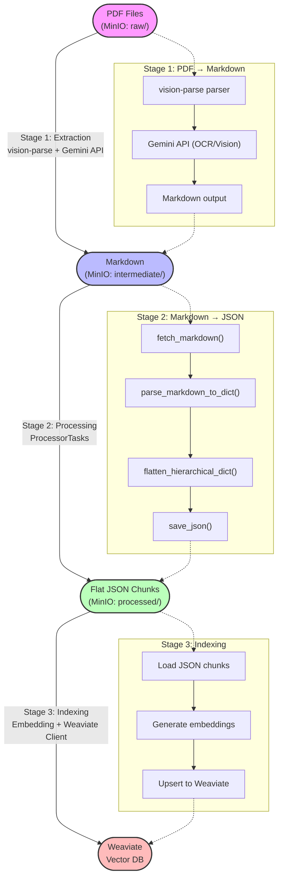

# Data Processing Pipeline — Chunking & Indexing Architecture

This document describes the data flow from raw PDF files through to vector storage for the Vietnamese Educational RAG system.

## 1. Pipeline Overview



## 2. Stage Details

### Stage 1: PDF → Markdown (`p01_extractor.py`)
- **Tool**: `vision-parse` library with **Gemini API** as the vision backend.
- **Goal**: Convert PDFs to Markdown while preserving structure (Headers, Tables, Lists).
- **Output**: `.md` files stored in MinIO `intermediate/` via `MinIOStorage`.

### Stage 2: Markdown → Flat JSON (`p02_processor.py` — `ProcessorTasks`)

This is the core processing stage implemented by the `ProcessorTasks` class.

#### 2.1 `fetch_markdown(bucket, filename, category)`
- Downloads `.md` file from MinIO using `MinIOPathManager` to resolve the canonical path.
- Returns content as a UTF-8 string.

#### 2.2 `parse_markdown_to_dict(content, file_title)`
- Scans Markdown line by line, detecting `#` headers to build a **hierarchical tree**.
- Each node contains: `title`, `content`, `metadata.header_path`, `children[]`.
- `header_path`: breadcrumb string from the file title to the current node (joined by ` > `).
  - Example: `"CTDT_CNTT > Chương 1 > Mục tiêu"`
- Section keys follow the pattern: `section_1`, `section_1_1`, `section_1_1_2`, etc.

#### 2.3 `flatten_hierarchical_dict(nested_dict)`
- Traverses the nested tree recursively and extracts each section into a **flat list**.
- Each item: `{ "id", "title", "content", "metadata" }`.

#### 2.4 `save_json(bucket, filename, data, category)`
- Serializes the flat list to a formatted JSON string (`indent=4`).
- Uploads to MinIO `processed/` using `MinIOStorage`.

#### Path Management — `MinIOPathManager`
- Single source of truth for all MinIO directory prefixes.
- Categories: `raw/`, `intermediate/`, `processed/`.
- Validates category names before any storage operation.

### Stage 3: Indexing (`p03_indexer.py`)
- Reads JSON chunks from MinIO `processed/`.
- **Embedding**: Uses `weaviate-client` compatible embedding models (optimized for Vietnamese).
- **Storage**: Upserts into **Weaviate** Vector DB for semantic search.
- Each chunk stored with its `header_path` metadata for source attribution.

---

## 3. Airflow Orchestration

The Processor stage (Stage 2) is wrapped as an **Apache Airflow DAG**:

```
fetch_markdown → convert_to_json → save_json
```

- **Trigger**: Manual only.
- **Implementation**: `airflow/dags/processor.py` imports `ProcessorTasks`.

See [airflow/README.md](../airflow/README.md) for setup instructions.

---
*Last updated: 2026-03-14*
