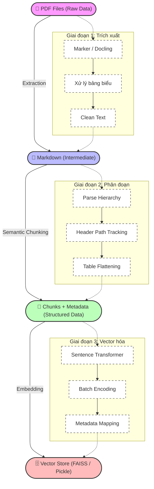

# Kiến trúc Pipeline Xử lý Dữ liệu (Chunking & Indexing)

Tài liệu này mô tả chi tiết luồng xử lý dữ liệu từ các file PDF thô cho đến khi được lưu trữ vào Vector Database để phục vụ hệ thống RAG.

## 1. Tổng quan Pipeline

Hệ thống sử dụng quy trình xử lý 3 giai đoạn chính, tập trung vào việc bảo toàn cấu trúc phân cấp của tài liệu (Hierarchical Structure) để tối ưu hóa quá trình truy vấn ngữ cảnh.

## 2. Chi tiết các giai đoạn

### Giai đoạn 1: PDF to Markdown
*   **Công cụ**: Sử dụng **Marker** hoặc **Docling** để trích xuất nội dung từ PDF.
*   **Mục tiêu**: Chuyển đổi PDF sang Markdown để giữ lại các định dạng cấu trúc như Headers (#, ##, ###), bảng (Tables), và danh sách (Lists).
*   **Xử lý bảng**: Các bảng được nhận diện và chuyển đổi sang dạng text có cấu trúc để model embedding dễ hiểu hơn.

### Giai đoạn 2: Markdown to Chunks & Metadata
*   **Semantic Chunking**: Thay vì cắt theo độ dài cố định, hệ thống cắt dựa trên cấu trúc Header của Markdown.
*   **Header Path**: Mỗi chunk sẽ mang theo "đường dẫn" của nó (ví dụ: `Ngành CNTT > Chương trình chi tiết > Kiến thức cơ sở`).
*   **Metadata**: Lưu trữ thông tin về tiêu đề chương, mục, tên file nguồn để phục vụ việc hiển thị nguồn tham khảo sau này.

### Giai đoạn 3: Vector Store & Indexing
*   **Embedding Model**: Sử dụng mô hình `AITeamVN/Vietnamese_Embedding` (hoặc tương đương) được tối ưu cho tiếng Việt.
*   **Lưu trữ**:
    *   `vectorized_data.pkl`: Chứa vector embeddings và metadata đầy đủ.
    *   `vectorized_metadata.json`: Chứa thông tin văn bản và metadata để tra cứu nhanh.
*   **Cấu trúc Vector**: Mỗi đoạn văn bản được chuyển thành một vector 768 chiều (tùy model) và lưu vào FAISS Index để tìm kiếm độ tương đồng cosine.

---
*Tài liệu này được cập nhật tự động bởi hệ thống Agentic RAG.*
